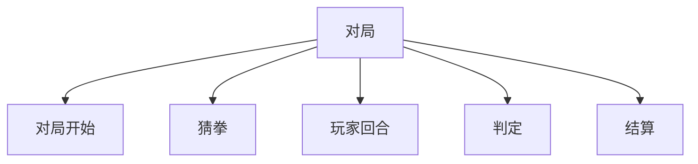
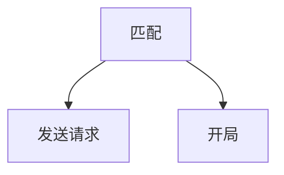

## &#x20;\*\* 游戏规则\*\*

1.  游戏方式：二人对局，两方五枚棋子。对局开始，初始棋盘如下图，两方玩家各执一方，轮流执行指令（称*下棋*），直至对局结束。 （主要参考 - [视频地址](https://www.bilibili.com/video/BV1ej41167yv/?buvid=XU2A5E92F24EF0B57A9EC1F7CD553B605794F\&from_spmid=search.search-result.0.0\&is_story_h5=false\&mid=08dIy0BsXZ%2F4BWzaFM1tVg%3D%3D\&p=1\&plat_id=116\&share_from=ugc\&share_medium=android\&share_plat=android\&share_session_id=3db20ad1-8e76-408f-803f-3a16145029da\&share_source=COPY\&share_tag=s_i\&spmid=main.ugc-video-detail.0.0\&timestamp=1697782824\&unique_k=hkvR1nB\&up_id=3493269279344767)）

2.  配置：

    *   两个人
    *   10个棋子（两方各5个，分别是1个王和4个兵）
    *   5张牌

3.  游玩步骤：

    *   对局开始：

        *   初始化棋盘。
        *   5张牌置于牌库，洗牌。
        *   双方玩家从牌库抽取2张牌（随机）。剩下一张留置牌库。
    *   猜拳环节：决定先后手。
    *   玩家回合步骤：

        *   挑选一张手牌。
        *   选择要移动的棋子。
        *   选择要移动的格子。
        *   判断操作合法性。
    *   判定：

        *   判断是否吃子
        *   若有，且吃掉对方玩家的王，对局结束，己方获胜。
    *   回合结算：

        *   将玩家使用的手牌置于牌库底部。
        *   该回合玩家从牌库顶部抽取一张新的手牌。（补充至2张手牌）

4.  规则限制：
    *   己方棋子移动时不能重叠在己方棋子上，不能走出棋盘。
    *   己方棋子移动时允许置于棋盘空格、敌方棋子格（若如此做，视为*吃子*）将该敌方棋子移出棋盘。
    *   操作计时：玩家回合开始时，开始计时，若玩家在120秒内没有操作棋子的移动（即没有完成第3点游玩步骤-玩家操作步骤）。判负。
    *   投降： 玩家可以在任意时间点点击界面上的投降按钮，结束对局，视为该玩家输掉对局。

## 客户端逻辑：

